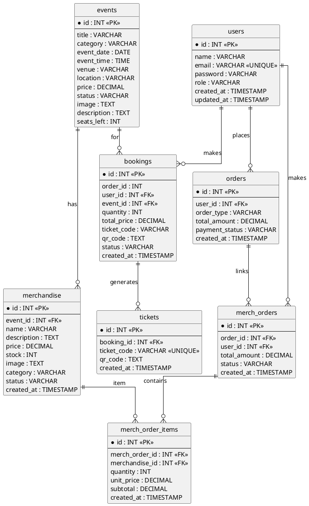

# Event Ticketing Platform — Technical Documentation

## 1. Overview

The Event Ticketing Platform is a full‑stack web application for browsing events, booking tickets, and purchasing event-related merchandise.

It consists of:

- **Backend**: Node.js + Express API (`event_ticketing_platform-backend/`)
- **Frontend**: React (Vite) SPA (`event_ticketing_platform-frontend/`)
- **Database**: MySQL schema in `event_ticketing_platform-backend/database/schema.sql`

### Core features

- User registration & login (JWT auth)
- Browse events and event detail views
- Ticket booking and ticket QR code generation (server-side)
- Order checkout (tickets + merchandise)
- Merchandise catalog and related orders
- Admin dashboard endpoints: analytics, bookings list, event/merch CRUD, user role updates

---

## 2. Repository layout

```
Final_Project-WAD/
  event_ticketing_platform-backend/
    server.js
    config/
    controllers/
    database/
    middleware/
    models/
    routes/
    services/
    utils/
  event_ticketing_platform-frontend/
    src/
    public/
    vite.config.js
```

### Backend entrypoint

- `event_ticketing_platform-backend/server.js`
  - Creates the Express app
  - Registers middleware (Helmet, CORS, JSON body parsing, rate limiting)
  - Mounts API routes under `/api/*`
  - Seeds the admin user on startup (`seedAdminUser()`)

### Frontend entrypoint

- `event_ticketing_platform-frontend/src/main.jsx`
  - React root
- `event_ticketing_platform-frontend/src/App.jsx`
  - Routes / pages composition

---

## 3. Tech stack

### Backend

- Node.js (ESM modules)
- Express 5
- MySQL database via `mysql2`
- JWT auth via `jsonwebtoken`
- Password hashing via `bcrypt` / `bcryptjs`
- Security headers via `helmet`
- Rate limiting via `express-rate-limit`
- Emailing receipts via `nodemailer`
- QR code generation via `qrcode`

### Frontend

- React + React Router
- Vite (build/dev)
- TailwindCSS (utility styling)

---

## 4. Environment configuration

### Backend environment variables

The backend reads environment variables from `event_ticketing_platform-backend/.env` using `dotenv`.

Common variables:

- `PORT`: API server port (default 5001)
- `DB_HOST`, `DB_PORT`, `DB_USER`, `DB_PASSWORD`, `DB_NAME`: MySQL connection
- `JWT_SECRET`: signing key for JWT tokens
- `JWT_EXPIRES_IN`: token lifetime (e.g. `1h`)

Optional integrations:

- `TICKETMASTER_API_KEY`: external events search
- `EMAIL_USER`, `EMAIL_PASS`, `EMAIL_HOST`, `EMAIL_PORT`, `EMAIL_SECURE`: email sending

Admin auto-seed:

- `ADMIN_NAME`, `ADMIN_EMAIL`, `ADMIN_PASSWORD`

> **Security note:** do not commit real secrets in `.env` to source control.

### Frontend environment variables

The frontend is configured to call the backend API via a base URL variable (e.g. `VITE_API_BASE_URL`).

Typical values:

- Local dev: `VITE_API_BASE_URL=http://localhost:5001`
- Production: `VITE_API_BASE_URL=http(s)://<your-backend-domain>`

---

## 5. Database schema (MySQL)

The canonical schema is defined in:

- `event_ticketing_platform-backend/database/schema.sql`

### Tables

- `events`: event catalog
- `users`: application users and roles
- `orders`: order header for checkout
- `bookings`: ticket purchases tied to user and event
- `tickets`: ticket records tied to bookings
- `merchandise`: products linked optionally to an event
- `merch_orders`: merchandise order header, optionally linked to `orders`
- `merch_order_items`: line items in a merchandise order

### Table format (data dictionary)

The following table-format definitions are based on `event_ticketing_platform-backend/database/schema.sql`.

#### `events`

| Column | Type | Null | Key | Default | Notes |
|---|---|---:|---|---|---|
| `id` | `INT` | NO | PK |  | Auto-increment |
| `title` | `VARCHAR(255)` | NO |  |  | Event name/title |
| `category` | `VARCHAR(100)` | NO |  |  | Category/tag |
| `event_date` | `DATE` | NO |  |  | Date |
| `event_time` | `TIME` | NO |  |  | Start time |
| `venue` | `VARCHAR(255)` | NO |  |  | Venue name |
| `location` | `VARCHAR(255)` | NO |  |  | City/region |
| `price` | `DECIMAL(10,2)` | NO |  |  | Base ticket price |
| `status` | `VARCHAR(50)` | NO |  | `Available` | Availability status |
| `image` | `TEXT` | YES |  |  | Image URL/base64 |
| `description` | `TEXT` | YES |  |  | Description |
| `seats_left` | `INT` | NO |  | `0` | Remaining capacity |

#### `users`

| Column | Type | Null | Key | Default | Notes |
|---|---|---:|---|---|---|
| `id` | `INT` | NO | PK |  | Auto-increment |
| `name` | `VARCHAR(255)` | NO |  |  | Display name |
| `email` | `VARCHAR(255)` | NO | UNIQUE |  | Login identifier |
| `password` | `VARCHAR(255)` | NO |  |  | Hashed password (bcrypt) |
| `role` | `VARCHAR(50)` | NO |  | `user` | `user` or `admin` |
| `created_at` | `TIMESTAMP` | NO |  | `CURRENT_TIMESTAMP` | Creation time |
| `updated_at` | `TIMESTAMP` | NO |  | `CURRENT_TIMESTAMP` | Auto-updated on change |

#### `orders`

| Column | Type | Null | Key | Default | Notes |
|---|---|---:|---|---|---|
| `id` | `INT` | NO | PK |  | Auto-increment |
| `user_id` | `INT` | NO | FK |  | → `users.id` (ON DELETE CASCADE) |
| `order_type` | `VARCHAR(50)` | NO |  | `mixed` | E.g. `tickets`, `merch`, `mixed` |
| `total_amount` | `DECIMAL(10,2)` | NO |  |  | Total paid value |
| `payment_status` | `VARCHAR(50)` | NO |  | `pending` | E.g. `pending`, `paid`, `failed` |
| `created_at` | `TIMESTAMP` | NO |  | `CURRENT_TIMESTAMP` | Creation time |

#### `bookings`

| Column | Type | Null | Key | Default | Notes |
|---|---|---:|---|---|---|
| `id` | `INT` | NO | PK |  | Auto-increment |
| `order_id` | `INT` | YES | IDX |  | Intended link to `orders.id` (indexed) |
| `user_id` | `INT` | NO | FK |  | → `users.id` (ON DELETE CASCADE) |
| `user_name` | `VARCHAR(255)` | YES |  |  | Denormalized snapshot |
| `user_email` | `VARCHAR(255)` | YES |  |  | Denormalized snapshot |
| `event_id` | `INT` | NO | FK |  | → `events.id` (ON DELETE CASCADE) |
| `quantity` | `INT` | NO |  |  | Ticket quantity |
| `total_price` | `DECIMAL(10,2)` | YES |  |  | Total for this booking |
| `ticket_code` | `VARCHAR(100)` | YES |  |  | Ticket code (legacy/optional) |
| `qr_code` | `TEXT` | YES |  |  | QR code payload |
| `status` | `VARCHAR(50)` | NO |  | `confirmed` | Booking status |
| `created_at` | `TIMESTAMP` | NO |  | `CURRENT_TIMESTAMP` | Creation time |

> Note: `bookings.order_id` is indexed in the schema, but no FK constraint is defined in `schema.sql`.

#### `tickets`

| Column | Type | Null | Key | Default | Notes |
|---|---|---:|---|---|---|
| `id` | `INT` | NO | PK |  | Auto-increment |
| `booking_id` | `INT` | NO | FK |  | → `bookings.id` (ON DELETE CASCADE) |
| `ticket_code` | `VARCHAR(100)` | NO | UNIQUE |  | Unique ticket identifier |
| `qr_code` | `TEXT` | YES |  |  | QR code payload |
| `created_at` | `TIMESTAMP` | NO |  | `CURRENT_TIMESTAMP` | Creation time |

#### `merchandise`

| Column | Type | Null | Key | Default | Notes |
|---|---|---:|---|---|---|
| `id` | `INT` | NO | PK |  | Auto-increment |
| `event_id` | `INT` | YES | FK |  | → `events.id` (ON DELETE SET NULL) |
| `name` | `VARCHAR(255)` | NO |  |  | Product name |
| `description` | `TEXT` | YES |  |  | Description |
| `price` | `DECIMAL(10,2)` | NO |  |  | Unit price |
| `stock` | `INT` | NO |  | `0` | Inventory count |
| `image` | `TEXT` | YES |  |  | Image URL/base64 |
| `category` | `VARCHAR(100)` | YES |  |  | Category |
| `status` | `VARCHAR(50)` | NO |  | `Available` | Availability status |
| `created_at` | `TIMESTAMP` | NO |  | `CURRENT_TIMESTAMP` | Creation time |

#### `merch_orders`

| Column | Type | Null | Key | Default | Notes |
|---|---|---:|---|---|---|
| `id` | `INT` | NO | PK |  | Auto-increment |
| `order_id` | `INT` | YES | FK |  | → `orders.id` (ON DELETE SET NULL) |
| `user_id` | `INT` | NO | FK |  | → `users.id` (ON DELETE CASCADE) |
| `total_amount` | `DECIMAL(10,2)` | NO |  | `0` | Overall merch total |
| `status` | `VARCHAR(50)` | NO |  | `pending` | Merch order status |
| `created_at` | `TIMESTAMP` | NO |  | `CURRENT_TIMESTAMP` | Creation time |

#### `merch_order_items`

| Column | Type | Null | Key | Default | Notes |
|---|---|---:|---|---|---|
| `id` | `INT` | NO | PK |  | Auto-increment |
| `merch_order_id` | `INT` | NO | FK |  | → `merch_orders.id` (ON DELETE CASCADE) |
| `merchandise_id` | `INT` | NO | FK |  | → `merchandise.id` (ON DELETE CASCADE) |
| `quantity` | `INT` | NO |  |  | Units ordered |
| `unit_price` | `DECIMAL(10,2)` | NO |  |  | Price at order time |
| `subtotal` | `DECIMAL(10,2)` | NO |  |  | `quantity * unit_price` |
| `created_at` | `TIMESTAMP` | NO |  | `CURRENT_TIMESTAMP` | Creation time |

### Entity Relationship Diagram (ERD)

Below is a **PlantUML** ER diagram you can render using a PlantUML plugin, or with an online PlantUML renderer.



### Key relationships

- `bookings.user_id → users.id`
- `bookings.event_id → events.id`
- `tickets.booking_id → bookings.id`
- `orders.user_id → users.id`
- `merchandise.event_id → events.id` (nullable)
- `merch_orders.user_id → users.id`
- `merch_orders.order_id → orders.id` (nullable)
- `merch_order_items.merch_order_id → merch_orders.id`
- `merch_order_items.merchandise_id → merchandise.id`

---

## 6. Backend architecture

The backend follows a typical layered Express structure:

- **Routes** (`routes/*.js`): URL paths and middleware wiring
- **Controllers** (`controllers/*.js`): request handling, validation orchestration
- **Models** (`models/*.js`): database queries and data access
- **Services** (`services/*.js`): cross-cutting business logic (booking, QR)
- **Middleware** (`middleware/*.js`): auth, admin checks, rate limiting, validation
- **Utils** (`utils/*.js`): helpers: response formatting, ticket codes, receipts, seeding

### Authentication & authorization

- `authenticateToken` middleware:
  - Expects `Authorization: Bearer <token>`
  - Verifies JWT using `JWT_SECRET`
- `requireAdmin` middleware:
  - Requires `req.user.role === 'admin'`

---

## 7. API Reference

Base URL (local): `http://localhost:5001`

### Health

- `GET /`
  - Response: `{ "message": "Backend is running" }`

### Auth

Mounted at `/api/auth`:

- `POST /api/auth/register`
  - Middleware: rate limiting + validation
  - Creates a user

- `POST /api/auth/login`
  - Middleware: rate limiting + validation
  - Returns JWT + user info

### Events

Mounted at `/api/events`:

- `GET /api/events`
- `GET /api/events/:id`
- `POST /api/events` (admin)
- `PUT /api/events/:id` (admin)
- `DELETE /api/events/:id` (admin)

### Bookings

Mounted at `/api/bookings`:

- `GET /api/bookings` (admin)
- `GET /api/bookings/user/:userId` (auth)
- `POST /api/bookings` (auth)
- `PUT /api/bookings/:id/add-tickets` (auth)
- `DELETE /api/bookings/:id` (admin)

### Orders

Mounted at `/api/orders`:

- `POST /api/orders/checkout` (auth)
  - Creates an `orders` row
  - Creates ticket bookings
  - Creates `merch_orders` + `merch_order_items` if merch exists

- `GET /api/orders/user/:userId` (auth)

### Merchandise

Mounted at `/api/merchandise`:

- `GET /api/merchandise`
- `GET /api/merchandise/event/:eventId`
- `GET /api/merchandise/recommended/:category`
- `GET /api/merchandise/:id`
- `POST /api/merchandise` (admin)
- `PUT /api/merchandise/:id` (admin)
- `DELETE /api/merchandise/:id` (admin)

### Merchandise Orders

Mounted at `/api/merch-orders`:

- `POST /api/merch-orders` (auth)
- `GET /api/merch-orders` (admin)
- `GET /api/merch-orders/user/:userId` (auth)

### Analytics

Mounted at `/api/analytics` (admin):

- `GET /api/analytics/bookings-per-event`
- `GET /api/analytics/top-events`
- `GET /api/analytics/overview`

### Recommendations

Mounted at `/api/recommendations`:

- `GET /api/recommendations/:eventId`

### External Events

Mounted at `/api/external-events`:

- `GET /api/external-events/search`

### Users (admin)

Mounted at `/api/users`:

- `GET /api/users` (admin)
- `PUT /api/users/:id/role` (admin)

---

## 8. Local development

### Prerequisites

- Node.js (LTS recommended)
- npm
- MySQL running

### Backend setup

1. Install dependencies
2. Create/configure `.env`
3. Create DB and apply schema `database/schema.sql`
4. Start server

Backend scripts (from `event_ticketing_platform-backend/package.json`):

- `npm run dev` (nodemon)
- `npm start`

### Frontend setup

1. Install dependencies
2. Set `VITE_API_BASE_URL`
3. Start Vite

Frontend scripts (from `event_ticketing_platform-frontend/package.json`):

- `npm run dev`
- `npm run build`
- `npm run preview`

---

## 9. Deployment notes (high level)

A production-ready deployment typically uses:

- Backend: a managed Node runtime (e.g., EC2 / EB / container)
- Database: managed MySQL (e.g., RDS)
- Frontend: static hosting (S3 + CDN)

Key considerations:

- Use HTTPS end-to-end to avoid mixed-content issues
- Set CORS rules appropriately in `server.js`
- Use secret managers / environment settings for secrets
- Run DB migrations/seed carefully (avoid dev-only destructive changes)

---

## 10. Troubleshooting

### API returns `ECONNREFUSED` to MySQL

- Check MySQL is listening on the expected `DB_HOST:DB_PORT`
- Ensure MySQL is not started with `--skip-networking`

### API returns `Access denied for user ...`

- Verify MySQL user exists for the exact host (e.g., `'user'@'localhost'` vs `'user'@'127.0.0.1'`)
- Reset password: `ALTER USER ... IDENTIFIED BY ...; FLUSH PRIVILEGES;`
- Grant DB permissions: `GRANT ALL PRIVILEGES ON event_ticketing_db.* ...`

### Admin endpoints return 403

- Confirm the logged-in user has `role=admin` in the **app** `users` table
- Ensure the JWT contains `role: 'admin'`

---

## 11. Glossary

- **App user**: a row in `event_ticketing_db.users` (controls website login)
- **MySQL user/account**: an entry in `mysql.user` (controls DB login)
- **Booking**: record of ticket purchase tied to an event
- **Order**: checkout entity that can include tickets + merchandise
